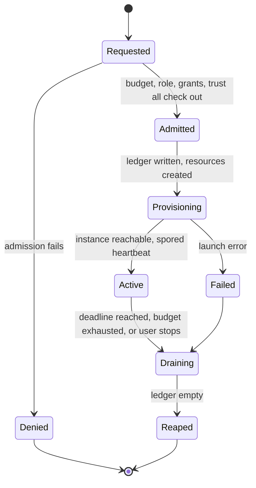

# The lease

P3 is the phase where the project succeeds or fails. Everything before it is
plumbing; everything after it assumes the lease works. This document is the
design; the work is tracked as Issues under the P3 milestone.

## What a lease is

A lease binds an **owner**, a **project**, a **target AWS account**, a **set of
resources**, a **budget**, and an **expiry** into one record with one lifecycle.

Nothing outlives its lease. Not the instance, not the security group rule, not
the credential grant, not the Globus endpoint, not the volume.

## The insight that makes this cheap

Enforcing a budget looks like it needs polling. It does not.

Cost Explorer lags by hours and is useless for a ten-minute lease. AWS Budgets
is worse. But for ephemeral compute, **spend is a deterministic function of
time**: `truffle` knows the rate at launch, and EC2 dominates the bill so
completely that storage and transfer are rounding errors.

So the budget converts into a deadline:

```
deadline = min(requested_expiry, started_at + remaining_budget / hourly_rate)
```

One number. One **EventBridge Scheduler** one-shot, created with the lease and
deleted with it. No polling loop, no sweeper Lambda, no clock.

The deadline is recomputed — and the schedule updated — on any event that
changes the rate: a spot price move, an instance added or removed, a budget
adjustment. Event-driven, never periodic.

**Enforcement is predictive. Reconciliation is Cost Explorer.** Every resource
is tagged with the lease ID, and a post-hoc job compares actual spend against
predicted spend. That is the audit trail and the calibration loop for the rate
model. It is never the enforcement path.

## States



Transitions are DynamoDB conditional updates on a single item, so concurrency
needs no locking. A transition that loses the condition check is a no-op, not
an error — two reapers racing is normal and both must be able to run.

## Intent before action

The failure mode that matters is a **stranded instance in someone else's
account**. It costs a stranger money and it destroys the trust the whole
BYO-account model depends on.

So the ledger is written **before** each resource is created, not after. A crash
between intent and creation leaves a reapable record pointing at something that
may not exist. Reap tolerates `NotFound` on every resource type and treats it as
success. The inverse — create then record — leaves orphans nobody can find.

Ledger entries, in creation order:

| Resource | Reaped by |
|---|---|
| STS grant | inline deny on `aws:TokenIssueTime`, plus short duration |
| Security group + session ingress rule | `RevokeSecurityGroupIngress`, then delete |
| Key material | delete |
| Instance | `TerminateInstances` |
| EBS volumes | `DeleteOnTermination`, verified |
| Globus GCP endpoint | Transfer API delete, via portal-held dependent token |

## Three independent teardown paths

The control plane will sometimes be unable to reach the target account — a
revoked role, a deleted trust, an outage. Teardown cannot depend on it.

1. **Portal-initiated.** EventBridge Scheduler fires at the deadline, Lambda
   assumes the cross-account role, walks the ledger. The normal path.
2. **On-node.** `spored` carries its own deadline and self-terminates. Survives
   the portal being unreachable. Requires `InstanceInitiatedShutdownBehavior:
   terminate`.
3. **EC2-native backstop.** A hard `shutdown` scheduled at deadline plus a
   margin, set at boot. Survives `spored` itself dying.

Each path is idempotent and each is sufficient alone.

## Admission control

Before anything is created, a request is checked against: project budget
remaining, the caller's portal role, the dataset grants the request implies, the
onboarded account's trust validity, and instance quota.

Keep this behind a narrow interface. P7 will make the role and grant checks much
richer, and P3 should not have to be reopened when it does.

## What spore.host has to grow

Per the cohort decision record, `spawn/pkg/provider/ec2.go` operates **on-node
via IMDS self-identity** — it is not an off-node launcher of externally-named
instances, and the refactor explicitly must not turn it into one. So:

- **Off-node launching** goes through `cohort`'s `Actuator`/`Observer` ports,
  with an Arpeggio-side AWS substrate that assumes the cross-account role.
  This is the same shape as queryzero's `internal/substrate/aws`.
- **`spored`** needs a deadline, a self-terminate path, and a heartbeat the
  portal can observe to move `Provisioning → Active`.
- **`truffle`** supplies the rate that the deadline math depends on, including
  the spot price at launch and a callback when it moves.

`cohort` still imports nothing from the suite and no cloud SDK. Arpeggio is a
consumer, like `spawn` and `queryzero` — that it compiles against an unmodified
`cohort` is the proof the abstraction is real.

## The P3 gate

A ten-minute lease with a fifty-cent budget, launched and then abandoned.

An hour later: no instance, no volume, no security group rule, no Globus
endpoint, no schedule, and a Cost Explorer line that agrees with the prediction.
